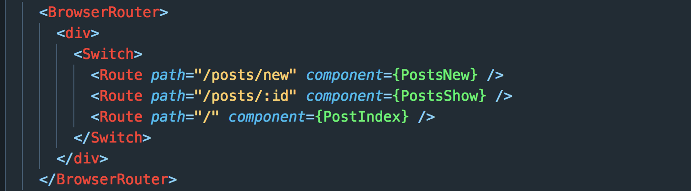
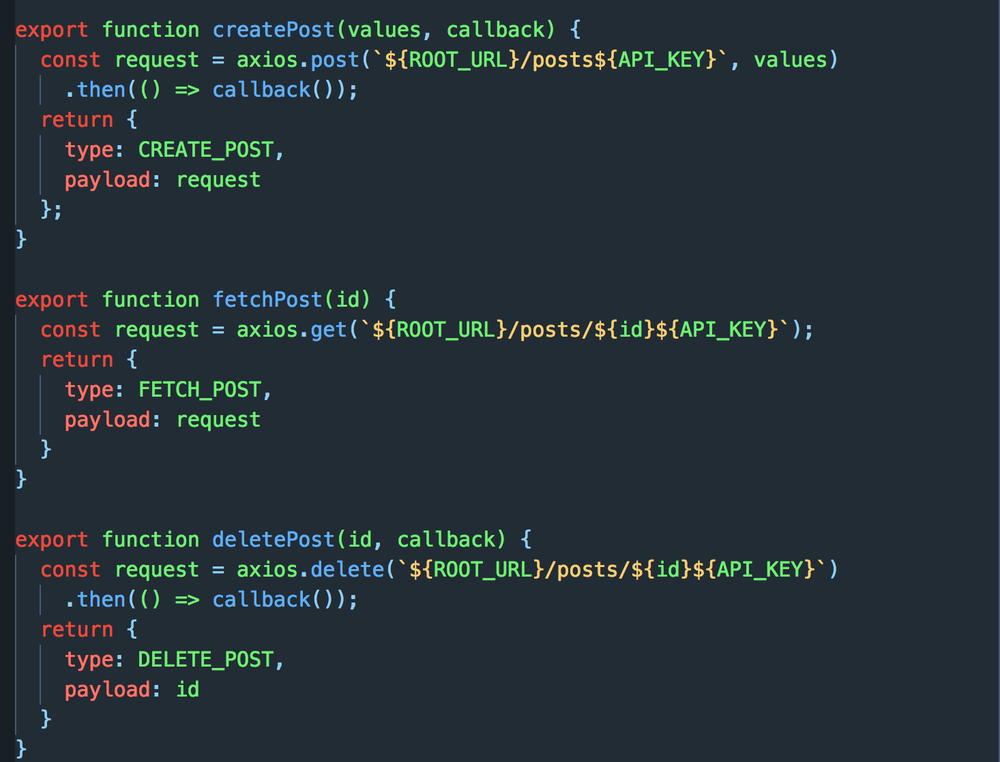
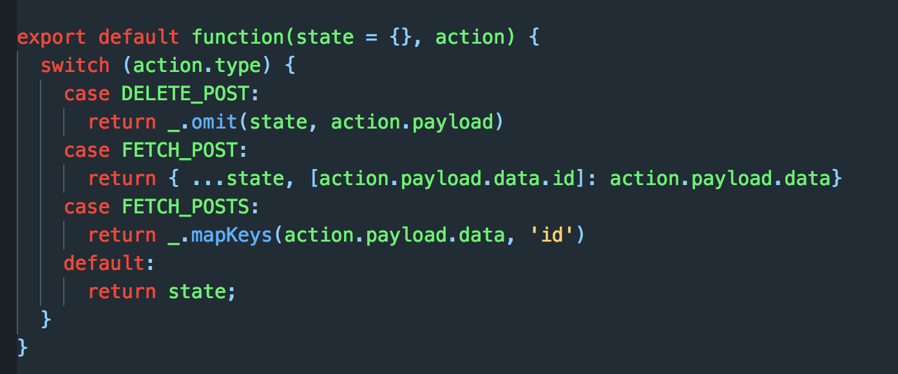
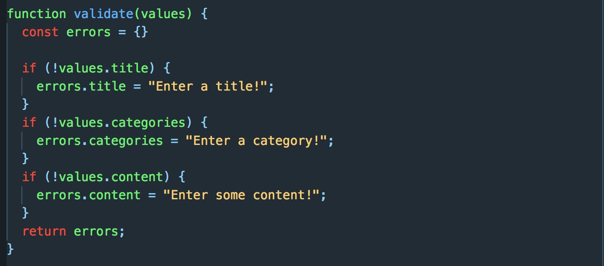

# Blog
A simple blog allowing the user to add posts, view them in detail and delete them when necessary.

Using advanced redux techniques the site runs incredibly quickly, storing data from a remote API and only making it available to React when necessary.

### React-Router



React Router tied components to paths making it possible to display to display only one component on the page at a time without actually changing address. Having the 'posts_show' page route defined as '/posts/:id' gave scope to access individual posts. Using this param Redux only made available the data specific to that post id.

### Action-Creators



Redux action creators made a series of API requests, interpolating post ID's and making callbacks redirect programmatically to the index page. 'Redux Promise' middleware ensures the promise is resolved before the payload is passed to the reducer.

### Post Reducers



The post reducer defines three scenarios: DELETE_POST, FETCH_POSTS and FETCH_POST. In FETCH_POST new data is concatinated with the existing state using the '...' function. FETCH_POSTS uses Lodash's mapKeys function to take the post ID and append it as a key.

### Redux-Form validation



Redux-form passes the input to the action-creators. Using its inbuilt validation process the user is alerted if the correct data is not entered into the form. 


### To run
```
$ git clone https://github.com/joecowton/react-redux-blog/
$ cd react-redux-blog
$ npm install
$ npm start
```
